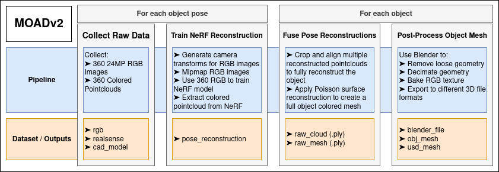

# Manufacturing Objects & Assemblies Dataset v2 (MOADv2)   
   
This repository serves as an access point for the MOADv2 dataset. MOADv2 contains component data for NIST Assembly Task Boards (ATB) 1-4. More information can be found on the [Official MOAD Website](https://www.robot-manipulation.org/nist-moad).  
   
Within the config folder, there is **objects.json** which defines which objects/sets are available for download, and **downloader_config.json** which allows you to configure which object set you would like to download, the folder to download to, and which types of object data you would like to download.  
Once **downloader_config.json** is configured as desired, simply run the downloader script via:   
*NOTE: It will prompt you to make sure everything looks correct before beginning the download.*  
```
cd MOADv2    
python3 scripts/download_moad.py   
```   
   
#### Downloadable Data Formats 
* **RGB** - Most objects were scanned in two different poses, and each pose contains 360 24 megapixel (6000x4000) images capturing all angles of the object. Captured using Canon Rebel SL3 DSLR cameras. This option also includes a **camera_config.json** file which describes the camera settings during capture, and **transforms.json** which defines the virtual camera pose for each image. *NOTE: This data (1.6GB / pose) takes a long time to download.*  
* **Pose Reconstruction** - The RGB images were used to train a NeRF reconstruction of each object scan, and this option will download a dense (5 million points) point cloud which was exported from that trained model.  
* **Realsense** - Each object pose also contains 360 colored pointclouds captured at 640x480 resolution, and transformed such that they all align with each other. Captured using Realsense D455 depth cameras.  
* **CAD Model** - CAD model of the object.  
* **Fused Model** - All data associated with multiple poses of the object being fused together to create complete object models.  
    * **Raw Cloud (.ply)** - This is the result of fusing the reconstruction pointclouds together from multiple poses to get a pointcloud of the entire object. All background points have been removed.  
    * **Raw Mesh (.ply)** - The result of applying Poisson surface reconstruction to the Raw Cloud.  
    * **OBJ Mesh** - Post processed mesh (cleaned, decimated, scaled to meter units), exported to an OBJ file format. Good for simulators like PyBullet.  
    * **USD Mesh** - Post processed mesh (cleaned, decimated, scaled to meter units), exported to an USD file format. Good for simulators like NVIDIA Omniverse, and Isaac Sim.  
    * **Blender File** - A .blend file containing the post processed version of the fused model, so the model can be further processed or exported to a different file format.  


#### Use Cases   
###### Object Reconstruction   
The high resolution RGB data combined with pre-computed camera transforms may be used to try alternative object reconstruction techniques.     

###### Synthetic Data Generation  
The provided model reconstructions may be used for generating synthetic training data using tools like Unity Perception or NVIDIA Omniverse Replicator. This data can be used for training object detection models, segmentation models, grasp planners, etc.    


# Scripts
We provide several optional scripts to give you more flexibility when working with the dataset.

#### Generate URDF files:
This script creates URDF models for objects in your downloaded dataset. URDF files are useful for simulation environments such as PyBullet, where URDF is the preferred model format.
``` 
python3 scripts/create_urdf_files.py --folder <folder_name>
```
Replace <folder_name> with the directory containing your downloaded dataset of objects you would like to use.   

#### Blender Mesh Post-Processing Scripts:  
The purpose of these scripts is to automate mesh post-processing and file format conversion using Blenders python API.  
**blender_convert_ply.py** and **blender_convert_cad_to_usd.py** can be called using Blender in the terminal like so:   
```  
blender --background --python {/path/to/convert_script.py} -- {/path/to/input/file}   
```  
The **blender_convert_ply.py** script was used to generate all of the cleaned meshes and blender file (*obj_mesh*,*usd_mesh*,*blender_file*) present in the MOADv2 dataset. These steps include applying a scale factor, centering the meshs origin, removing loose geometry, decimating geometry (in most cases with a factor of 0.1), generating a UV map, baking a texture map, and exporting the resulting meshes. **blender_convert_cad_to_usd.py** does less processing, only applying a scale factor, centering the mesh, and exporting to USD format so that they may be used with Omniverse Replicator (these are not currently included in the dataset, but can be generated as needed).  

The corresponding scripts **blender_batch_convert_ply.py** and **blender_batch_cad_to_usd.py** are used to run the previously described conversion scripts on batches of models at once. They search a root_directory for a specified file name pattern, and assemble a list of files to process, then call a subprocess to run the conversion scripts with each of those files. Currently, these scripts need to be configured directly, rather than being nicely parameterized (which will be fixed in the future), and they can be ran via:  
```
python3 {/path/to/batch_script.py} 
```   